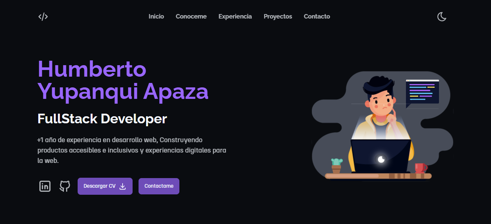

# Portfolio

This is a portfolio project that demonstrates my web development skills. The project is built with Astro and Tailwind, and is deployed on Fly.io.

## 🧰 Used tools
The tools I used to build this project are:
- **[Astro](https://astro.build):** a static web framework that helped me create a fast and modern website.
- **[Tailwind](https://tailwindcss.com):** a utility-first CSS framework that helped me style the website.
- **[Fly.io](https://fly.io):** here I deployed the website.
- **[Docker](https://docker.com):** a platform that helped me to package and implement the website in a simple and fast way.
- **[Figma](https://figma.com):** a platform that helped me to design the website.
## 🖌️ Design
To design and layout use Figma:
- Use a single page layout to simplify navigation.
- Use a responsive design so that the site looks good on different devices and screen sizes.
## 📷 Screenshots
Here are some screenshots of the site on different devices and screen sizes:
> 💻 Desktop, tablet and mobile.
## Resources
Here are some resources I used to learn about the tools and techniques I used:
- **[The Astro documentation.](https://astro.build)**
- **[The Tailwind CSS documentation.](https://tailwindcss.com)**
- **[The Docker documentation.](https://docker.com)**
- **[The Figma documentation.](https://figma.com)**
- **[The Fly.io documentation.](https://fly.io)**


## 📦 Deploying
[](https://stackblitz.com/github/withastro/astro/tree/latest/examples/basics)
[](https://codesandbox.io/p/sandbox/github/withastro/astro/tree/latest/examples/basics)
[](https://codespaces.new/withastro/astro?devcontainer_path=.devcontainer/basics/devcontainer.json)

> 🧑‍🚀 **Seasoned astronaut?** Delete this file. Have fun!

[](#)


## 🚀 Project Structure

Inside of your Astro project, you'll see the following folders and files:

```
/
├── public/
|   |-- fonts/
|   |   └── ....
│   └── favicon.svg
├── src/
│   ├── components/
│   │   └── ...
│   ├── layouts/
│   │   └── Layout.astro
│   └── pages/
│       └── index.astro
└── package.json
```

Astro looks for `.astro` or `.md` files in the `src/pages/` directory. Each page is exposed as a route based on its file name.

There's nothing special about `src/components/`, but that's where we like to put any Astro/React/Vue/Svelte/Preact components.

Any static assets, like images, can be placed in the `public/` directory.

## 🧞 Commands

All commands are run from the root of the project, from a terminal:

| Command                   | Action                                           |
| :------------------------ | :----------------------------------------------- |
| `npm install`             | Installs dependencies                            |
| `npm run dev`             | Starts local dev server at `localhost:8080`      |
| `npm run build`           | Build your production site to `./dist/`          |
| `npm run preview`         | Preview your build locally, before deploying     |
| `npm run astro ...`       | Run CLI commands like `astro add`, `astro check` |
| `npm run astro -- --help` | Get help using the Astro CLI                     |
